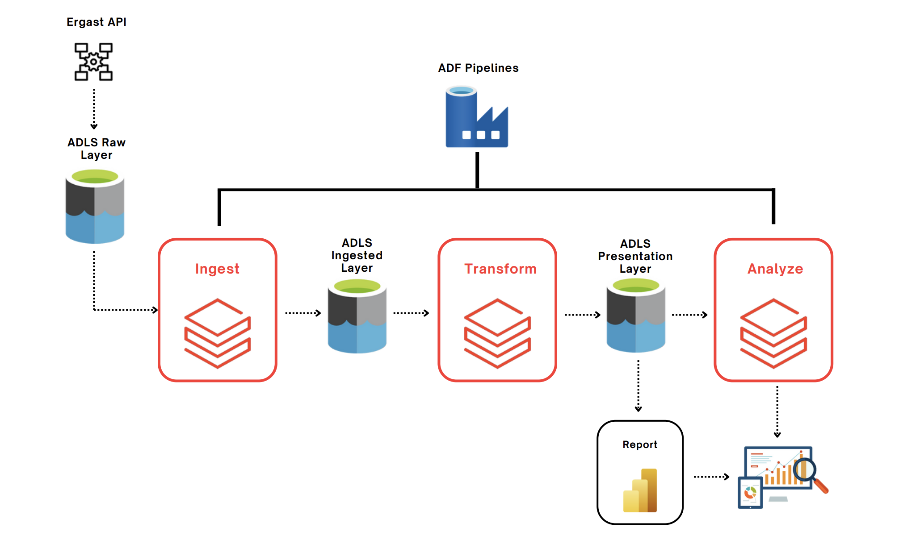

# Formula One Statistics on Azure Databricks

## System Architecture


## Project Overview:

This project focuses on learning and implementing Azure and Databricks services within a lakehouse architecture framework. The primary objective is to collect raw data from the Ergast Developer API and store it in Azure Data Lake Storage (ADLS). Subsequently, the data undergoes cleaning and processing in Databricks, utilizing PySpark and SQL, to facilitate analytics on Formula One historical data spanning from 1950 to 2021. To optimize efficiency, the project incorporates partial incremental data loading as well as full refresh mechanisms. Additionally, the entire pipeline is orchestrated in Azure Data Factory, which manages dynamic parameters and triggers to execute the pipeline on a regular schedule.

## System Architecture



---


## Project Overview:


## Learning Outcomes:

1. Building real-world data projects using Azure Databricks and Spark Core.

2. Acquiring professional-level data engineering skills in Azure Databricks, Delta Lake, Spark Core, Azure Data Lake Gen2, and Azure Data Factory (ADF).

3. Creating notebooks, dashboards, clusters, cluster pools, and jobs in Azure Databricks.

4. Transforming and analyzing data using Spark SQL in Azure Databricks.

5. Implementing a Lakehouse architecture using Delta Lake.

6. Creating Azure Data Factory pipelines to execute Databricks notebooks and triggers to schedule pipelines, monitoring them.


## Project Folder Structure

Below is the outline of the project's directory and file structure:

```bash
f1_stats_azure_databricks # Root folder of the project
│
├── Ingestion in Delta # Folder with ingestion notebooks from ADLS raw layer
│
├── Trans # Data transformation notebooks 
│
├── Analysis # Various analysis on data for Databricks dashboard
│ 
├── Set Ups # Env set up for accessing ADLS containers for Azure cloud.
│ 
├── SQL Ingestion # For loding data in DBFS SQL server
│ 
└── screenshots # Screenshots of various implemented parts
```


## Tools & Platforms:

- **Azure Databricks**: For accessing and transforming data from ADLS raw layer and writing it back to processed layer. For Creating notebook workflows and using databricks utilities.  
  text.

- **PySpark and SQL**: Processing various file formats in CSV, simple and complex JSON. Implementing full refresh and incremental load patterns using partitions. 
  
- **Delta Lake**: Lakehouse architecture implementation in Delta Lake with incremental load patterns
  later for this project.

- **Azure Data Factory**: Createing robust pipeline with ADF triggers for executing Databricks notebooks on a regular schedule.

- **Power BI**: For visualization and analysis.